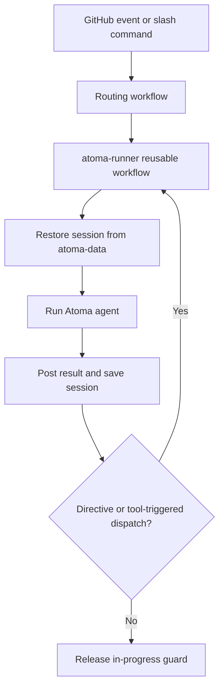

# Atoma Autonomous Delivery

Atoma Autonomous Delivery is a copyable GitHub Actions delivery system powered by Atoma, not Atoma core itself.

## What you get

After adoption, opening or updating an issue/PR can trigger an agent run that:

- restores per-agent session context
- runs Atoma with your configured agent/tools/skills
- comments results back on the issue/PR
- dispatches the next agent when a handoff directive is present

## Shortest adoption path

The deliverable ships as a release asset. Extract it at your repository root — the
archive holds `.github/`, so the files land where they belong:

```bash
cd /path/to/your-repo
curl -fsSL -o atoma-delivery.zip \
  https://github.com/yuma-seno/atoma-autonomous-delivery/releases/latest/download/atoma-delivery.zip
unzip -o atoma-delivery.zip
rm atoma-delivery.zip
```

Then commit in your target repository.

`latest` is the convenient path. Pin a version instead when you want to know what
you adopted and diff it later — see
[Upgrading an adopted repository](docs/customization.md#upgrading-an-adopted-repository):

```bash
gh release download v0.1.1 -R yuma-seno/atoma-autonomous-delivery -p atoma-delivery.zip
```

## Preflight checklist

Required before first run:

- GitHub Actions enabled in the target repository.
- In the target repository, open **Settings > Actions > General > Workflow permissions** and enable **Allow GitHub Actions to create and approve pull requests**. Without this repository-level permission, the engineer agent cannot create pull requests.
- Repository secret for at least one model path:
  - `OPENAI_API_KEY` (OpenAI-compatible path), or
  - `ANTHROPIC_API_KEY` (Anthropic path).
- If a branch ruleset requires a status check, the workflow that produces it must
  be startable with `workflow_dispatch`. Agents run it themselves; a workflow they
  cannot start leaves the check unfilled and the pull request unmergeable
  forever. See
  [Requiring a check that agents can satisfy](docs/customization.md#requiring-a-check-that-agents-can-satisfy).
- An agent will not merge a pull request that changes how agents run — workflows,
  agent definitions, and similar. It reviews and reports; the merge is yours. See
  [Changes an agent may not merge](docs/customization.md#changes-an-agent-may-not-merge).
- Nothing to do for labels. `atoma/in-progress`, `atoma/sub-issue` and
  `atoma/launched` are created on first use. Rename them in `config.json` if your
  taxonomy differs.
- These entries in your `.gitignore`. A run writes them to the repository root, and
  without this the engineer's `git add -A` commits its own session and logs into the
  branch — and `create_pr`, which requires a clean worktree, then refuses every
  time:

  ```gitignore
  atoma_logs.txt
  atoma_output.txt
  atoma_ops.log
  events.json
  session.json
  ```

- Optional repository variables:
  - `OPENAI_BASE_URL`
  - `ATOMA_PROVIDER` (`openai` or `anthropic` with the credentials wired by this template)

Workflow permissions are already declared in the generated workflows (`actions`, `issues`, `pull-requests`, `contents` set to write where needed), but they do not override the repository-level setting above.

## First issue and success criteria

Create an issue whose first non-blank line is a slash command, for example:

```text
/orchestrator

Build a plan to split this task into sub-issues.
```

Observable success criteria:

- `Atoma Entry` routes to `atoma-runner`.
- The issue gets the `atoma/in-progress` label while running.
- The agent posts a result comment or performs a visible handoff/tool action.

## Lifecycle



## Choose your path

- Customization contract and recipes: [docs/customization.md](docs/customization.md)
- Runtime operations and troubleshooting: [docs/operations.md](docs/operations.md)
- Contributing to this template repository: [CONTRIBUTING.md](CONTRIBUTING.md)
- Atoma core CLI/runtime docs: https://github.com/yuma-seno/atoma

## Limits, security, and cost notes

- Auto-dispatch loop is capped at 5 consecutive no-new-event handoffs.
- Session serialization per issue/PR is guarded by the `atoma/in-progress` label and workflow concurrency group.
- The shell guard is a denylist-based command filter, not a full sandbox.
- Some workflows use `pull_request_target`, which runs with base-repository privileges. Review your repository policy for third-party PRs.
- An agent only starts when a repository member triggered it. Outside contributors can open issues, comment and raise pull requests freely; none of it dispatches an agent, so no untrusted instruction reaches one and no model budget is spent. Every routing workflow fires on a human action, and agents reach the runner through `workflow_dispatch` instead, so this covers the whole untrusted surface.
